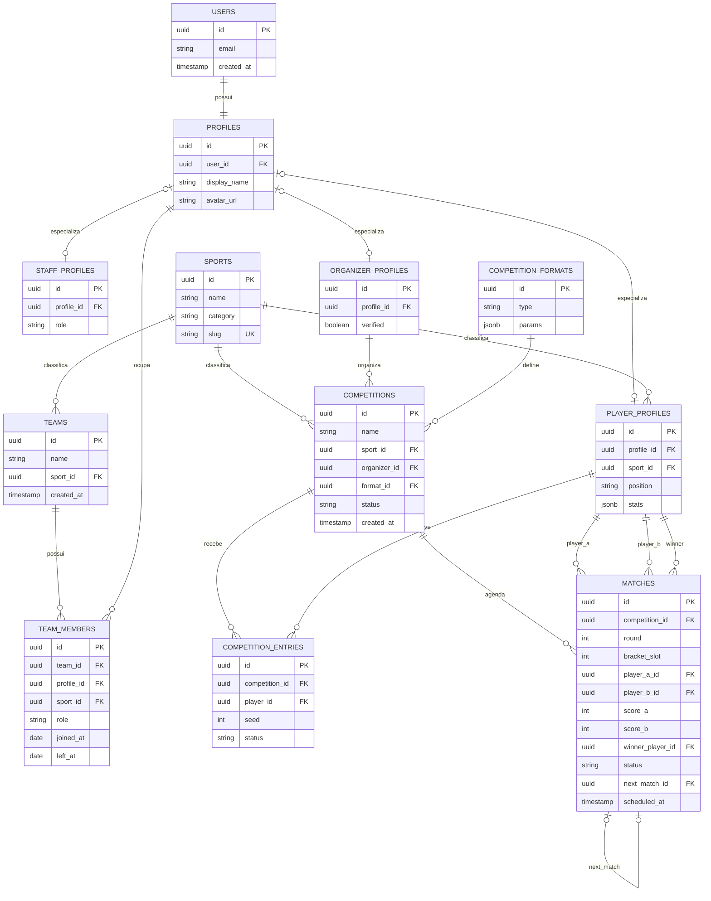

# 02 — Modelagem de Dados

> Parte da documentação de arquitetura da Plataforma de Gestão de Competições. Ver [README.md](../README.md) para o índice completo. Ver também: [01-visao-geral.md](./01-visao-geral.md) e [05-roadmap.md](./05-roadmap.md).

## Escopo do schema

| Camada | Fase 1 (MVP / lançamento) | Fase 2+ |
|---|---|---|
| Identidade + perfis + sports | Sim | — |
| Competitions + entries **por jogador** + matches 1v1 + formats | Sim | Inscrição por time, mais formatos |
| Teams + team_members | Schema ok; **não** no fluxo crítico do lançamento | Elenco, transfers, torneios por time |
| Standings | **Não** | Sim |
| Transfers / social | **Não** | Sim |
| Multi-organizador | **Não** (`organizer_id` único) | Se precisar |

O diagrama Mermaid abaixo é o **ER canônico do MVP** (torneio de lançamento = **x1**).

---

## Visão em árvore (MVP)

```
users (Supabase Auth)
 └── profiles (1:1)
      ├── player_profiles   ← inscrito no torneio x1
      ├── staff_profiles    ← opcional no lançamento
      └── organizer_profiles

sports                    ← seed: futebol e-sports

competitions
 ├── competition_formats  (single_elimination, participant_type=player)
 ├── competition_entries   (player_id — um jogador por inscrição)
 └── matches              (player_a vs player_b)

teams / team_members      ← no schema para o produto futuro; fora do fluxo x1
```

---

## Diagrama ER — MVP (canônico)



> Preview no GitHub/editor com suporte a Mermaid. Fonte da verdade do schema MVP.

---

## Contratos e enums (MVP)

### `competitions.status`

`draft` → `registration` → `in_progress` → `completed` | `cancelled`

### `competition_entries.status`

`pending` → `approved` | `rejected` | `withdrawn`

Só jogadores `approved` entram no chaveamento. Unique: `(competition_id, player_id)`.

`player_id` → `player_profiles.id`.

### `competition_formats` — MVP (x1)

| Campo | Valor MVP |
|---|---|
| `type` | `single_elimination` |
| `params` | ver contrato abaixo |

```json
{
  "participant_type": "player",
  "participant_count": 8,
  "best_of": 1,
  "seeding": "manual"
}
```

- `participant_type`: `player` no lançamento; `team` fica para torneios futuros
- `participant_count`: potência de 2 (`4` | `8` | `16`)
- `best_of`: placar em `score_a`/`score_b` = gols (ou vitórias no BO, se `best_of` > 1)
- `seeding`: `manual` | `random`

### `matches` — regras (x1)

| Campo | Regra |
|---|---|
| `round` / `bracket_slot` | Igual a qualquer bracket de eliminação |
| `player_a_id` / `player_b_id` | FK `player_profiles`; nullable até alguém avançar; bye = um lado null |
| `score_a` / `score_b` | Inteiros (gols); **não** string |
| `winner_player_id` | Obrigatório se `completed`; deve ser a ou b |
| `status` | `pending` \| `ready` \| `completed` \| `cancelled` |
| `next_match_id` | Próxima partida no bracket (null na final) |

RPCs: `generate_bracket` e `report_match_result` — ver [03](./03-arquitetura-tecnica.md).

### `team_members.role` (schema presente; uso pleno depois)

`owner` | `staff` | `player` — mesmo contrato de antes. Não entra no critério de sucesso do lançamento x1.

### Constraints obrigatórias (MVP)

```sql
create unique index competition_entries_player_unique
  on competition_entries (competition_id, player_id);

-- teams (quando usados):
create unique index team_members_active_unique
  on team_members (team_id, profile_id)
  where left_at is null;

create unique index team_members_one_active_team_per_sport
  on team_members (profile_id, sport_id)
  where left_at is null and role = 'player';
```

### `player_profiles.stats`

Contrato por `sport_id` na app. Seed lançamento (`futebol-esports`), exemplo:

```json
{ "preferred_platform": null, "fifa_id": null, "record": { "wins": 0, "losses": 0 } }
```

(Campos ilustrativos. Jogo concreto do lançamento: **EA FC** — ver freeze em [05-roadmap.md](./05-roadmap.md).)

---

## Decisões de modelagem

- **Lançamento = x1**: inscrição e confrontos por **jogador**, não por time.
- **`PROFILES` hub** + especializações.
- **`SPORTS` + slug**: seed `futebol-esports`.
- **Um organizador** por competição.
- **Times no schema**, fora do fluxo crítico do 1º torneio; torneio por time e `team_id` em entries = Fase 2.
- **Sem `standings`** no MVP.
- **Placar estruturado** + `winner_player_id` + `next_match_id`.

---

## Seed do MVP (dados iniciais)

| Entidade | Valor |
|---|---|
| `sports` | `name`: Futebol e-sports, `category`: esports, `slug`: `futebol-esports` |
| `competition_formats` | `type`: `single_elimination`, `params`: `{ "participant_type": "player", "participant_count": 8, "best_of": 1, "seeding": "manual" }` |

O título do jogo do lançamento é **EA FC** (detalhe de copy/UX); a modalidade no banco é `futebol-esports`.

---

## Fase 2+ (não no schema crítico do lançamento)

```
competition_entries.team_id     ← torneios por time (participant_type=team)
transfers / social / standings
matches com team_a/team_b       ← ou unificar via entry_id genérico
```

---
Anterior: [01-visao-geral.md](./01-visao-geral.md) · Próximo: [03-arquitetura-tecnica.md](./03-arquitetura-tecnica.md) · Índice: [README.md](../README.md)
